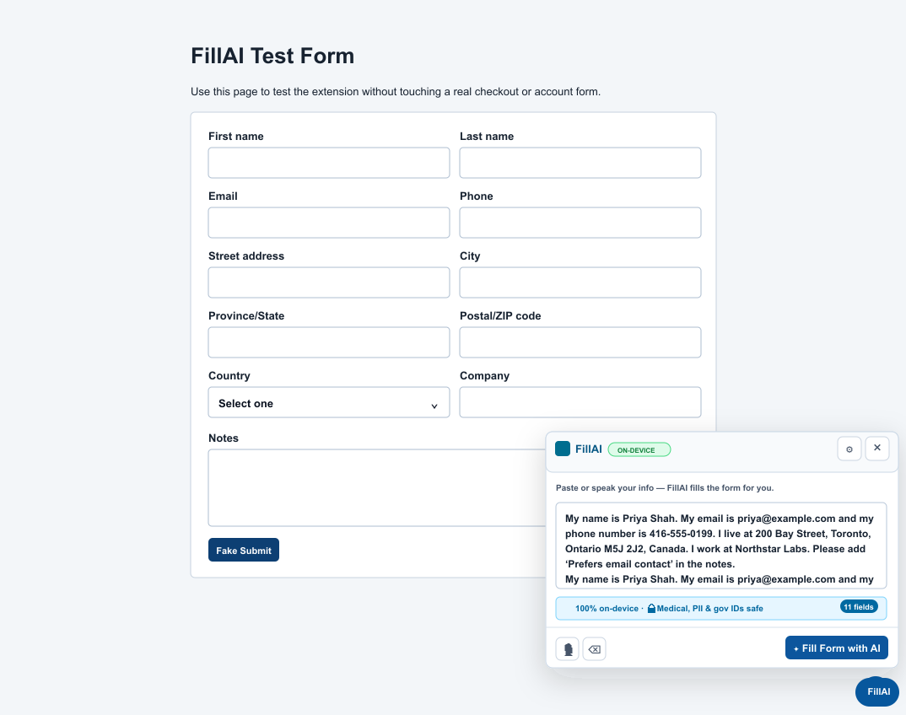
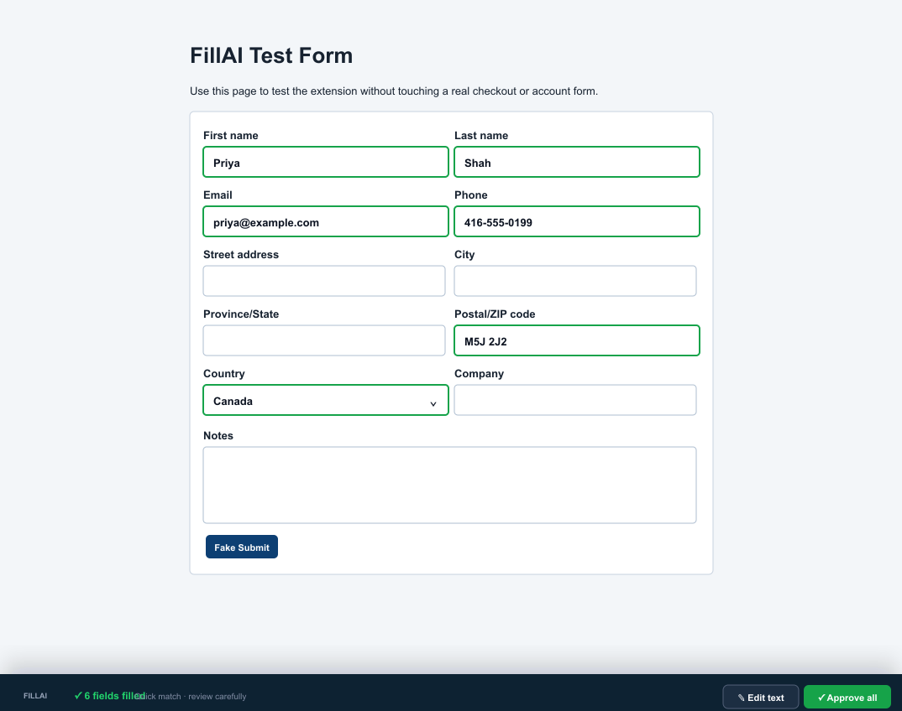

# FillAI

FillAI is a privacy-first browser extension that fills forms from plain English. Paste or speak what you want entered, review the draft, then approve the fill.

Everything is designed around one idea: **your form data should stay on your device**.

<p>
  
</p>

## What It Does

- Turns natural language into form values.
- Works on regular web forms with inputs, textareas, selects, labels, placeholders, and autocomplete hints.
- Lets you review every field before FillAI writes to the page.
- Shows quiet confidence dots instead of noisy percentages.
- Saves optional local defaults like name, email, phone, address, and custom fields.
- Uses an in-page panel. No confusing browser popup workflow.
- Supports Chrome, Edge, Firefox, and Chromium-based browsers.


## Screenshots

### Write Or Speak Once



### Review And Approve



## Privacy

FillAI is local-first.

- **No account required.**
- **No backend server required.**
- **No form data is sent to FillAI servers.**
- **Your saved defaults stay in browser local storage.**
- **You approve before anything is written into the page.**

When local AI model assets are enabled, the browser may download model files from their model host. The form text itself is processed locally after model availability. If model assets are unavailable, FillAI falls back to quick local pattern matching for common fields like name, email, phone, address, postal code, and custom defaults.

## Security

FillAI requests the minimum permissions needed for a form-filling extension:

- `activeTab`: interact with the current page after you invoke FillAI.
- `scripting`: inject the in-page FillAI panel when needed.
- `storage`: save your local defaults and draft text.
- `offscreen` on Chromium: run heavier local inference without freezing the UI.

FillAI does not silently submit forms. It sets approved values and dispatches normal `input` / `change` events so the page can react like a user typed them.

## Install From Release Zip

Download the latest release asset:

- `fillai-chrome.zip` for Chrome, Edge, Brave, Arc, and most Chromium browsers.
- `fillai-firefox.zip` for Firefox.

### Chrome / Edge / Chromium

1. Download and unzip `fillai-chrome.zip`.
2. Open `chrome://extensions`.
3. Enable **Developer mode**.
4. Click **Load unpacked**.
5. Select the unzipped `dist/chrome` folder.
6. Open a page with a form and click the **FillAI** extension icon.

### Firefox

1. Download and unzip `fillai-firefox.zip`.
2. Open `about:debugging#/runtime/this-firefox`.
3. Click **Load Temporary Add-on**.
4. Select `manifest.json` inside the unzipped Firefox build.

## Usage

1. Open a page with a form.
2. Click the **FillAI** extension icon or the FillAI page button.
3. Paste text or use the mic button.
4. Click **Fill Form with AI**.
5. Review the draft values.
6. Edit anything that looks off.
7. Click **Approve & Fill**.

Example input:

```text
My name is Priya Shah. My email is priya@example.com. My phone is 416-555-0199. I live at 200 Bay Street, Toronto, Ontario M5J 2J2.
```

## Defaults And Custom Fields

Open settings in the FillAI panel to save reusable local details:

- Full name
- Email
- Phone
- Address
- Custom fields like employee ID, membership number, department, or account number

These values are stored only in browser local storage and are used to improve matching.

## Voice Input

Voice input depends on browser speech support and microphone permission for the current page.

If voice does not start:

1. Refresh the page.
2. Click the mic button again.
3. Allow microphone permission if Chrome or Firefox asks.
4. Speak after the mic indicator says it is listening.

Chrome's built-in speech recognition may require Chrome's speech service to be reachable. If the browser reports a network speech error, paste or type text instead.

## Development

Install dependencies:

```bash
npm install
```

Typecheck:

```bash
npm run typecheck
```

Build both browser targets:

```bash
npm run build
```

Build one target:

```bash
npm run build:chrome
npm run build:firefox
```

Package zips:

```bash
npm run zip:chrome
npm run zip:firefox
```

## Project Structure

- `src/content.ts`: in-page UI, draft review, settings, voice flow.
- `src/page-voice-bridge.ts`: page-context speech recognition bridge.
- `src/background.ts`: extension action click, inference routing, offscreen setup.
- `src/ai/ai-core.ts`: local AI and fallback matching orchestration.
- `src/form-detector.ts`: field detection.
- `src/form-filler.ts`: preview, fill, and revert behavior.
- `src/ui/styles.css`: in-page panel styling.
- `public/icons/`: FillAI logo and extension icons.
- `dist/`: generated build outputs and release zips.

## Branding

Use **FillAI** everywhere. Brand assets and naming guidance are in [BRANDING.md](BRANDING.md).

## Donations

FillAI is free. Optional support is available through the Stripe link in the in-page settings panel. Donation details are documented in [STRIPE.md](STRIPE.md).

## Release Artifacts

Current local release assets:

- `dist/fillai-chrome.zip`
- `dist/fillai-firefox.zip`
